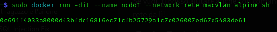

# Introduzione

La crescente complessità delle infrastrutture informatiche, unita all’aumento degli attacchi informatici, ha reso la cybersicurezza una priorità strategica. 

In questo contesto, tecnologie come la virtualizzazione e la containerizzazione assumono un ruolo centrale, poiché permettono di isolare ambienti, eseguire simulazioni di attacco/difesa e gestire in sicurezza risorse e applicazioni.

Questo progetto ha la proposta di:

·	   Spiegare le differenze tra virtualizzazione e containerizzazione;

·	Illustrarne vantaggi e svantaggi in ottica cybersecurity;

·	Mostrare come usare Docker per simulare una rete virtuale;

# La virtualizzazione

La virtualizzazione consiste nell’esecuzione di macchine virtuali (VM) che simulano hardware fisico su un host. Questo è possibile grazie a un hypervisor, che può essere:

·	**Tipo 1 (bare-metal)**: gira direttamente sull’hardware del server(es. VMware ESXi, Proxmox);

·	**Tipo 2 (hosted)**: gira sopra un sistema operativo (es. VirtualBox, VMware Workstation, KVM).

### I vantaggi della virtualizzazione

·	**Isolamento**: ogni VM è completamente isolata dalle altre, essendo quindi in un ambiente di sandbox, in caso di compromissione è difficile che si propaghi  anche alle altre VM.

·	**Snapshot**: si possono eseguire Snapshot delle VM, ovvero la possibilità di tornare ad uno stato precedente della macchina, utile in caso si debba testare qualche applicativo o analizzare un malware.

·	**Compatibilità**: è possibile creare più VM anche su un solo PC, riducendo i costi.

### Gli svantaggi della virtualizzazione:

·	**Consumo elevato di risorse**: ogni VM esegue un intero sistema operativo, con kernel, driver, servizi di base ecc. Questo comporta un maggiore utilizzo di RAM, CPU, memoria, rispetto ad un container.

·	**Superfice di attacco maggiore**: in caso dii utilizzo di hypervisor come ESXi e Proxmox, un attacco mirato a questi ultimi sfruttando una vulnerabilità è sufficiente per compromettere tutte le macchine virtualizzate su questi sistemi.

# La Containerizzazione

La containerizzazione, con strumenti come Docker, consente di eseguire contenitori (container) che condividono lo stesso kernel del sistema operativo host, ma sono isolati a livello di processo, rete e file system. 

### I vantaggi della containerizzazione
·	**Performance ottimizzata**: i container sono leggeri e veloci da avviare.

·	**Alta portabilità**: i contaner possono essere eseguiti ovunque sia installato Docker.

·	**Utili nella Cybersecurity**: permettono la rapida creazione di ambienti di test anche con risorse limitate.

### Gli svantaggi della containerizzazione
·	**Isolamento più debole**: i container condividono il kernel, quindi una superfice di attacco maggiore.

·	**Supportano solo un sistema operativo per host**: (es. solo container Linux su host Linux): perché sfruttano il kernel del sistema operativo.

# Nmap
Nmap (Network Mapper) è uno strumento open source utilizzato principalmente per la scansione e la mappatura delle reti.
Nmap serve a:

·	**Scoprire** host attivi su una rete (chi è online);

·	**Rilevare** le porte aperte su un dispositivo (quali servizi sono in ascolto);

·	**Identificare** servizi e versioni (es. tipo di server web, versione del software);

·	**Individuare** sistemi operativi (fingerprinting);

·	**Testare** la sicurezza della rete (pen testing);

·	**Mappare** infrastrutture di rete complesse;

Nmap invia pacchetti specifici a un target (IP o intervallo di IP) e analizza le risposte per determinare quali porte sono aperte, quali servizi sono attivi e altre informazioni.

Ha molte options disponibili, fra cui le piú comuni:

·	**-sS**: scansione solo SYN, stealth;

·	**-sT**: scansione TCP;

·	**-p**: specifica le porte;

·	**-sV**: specifica la versione del servizio scansionato;

·	**-o**: rileva la versione del Sistema Operativo.

# Caso pratico: simulazione di Rete con Docker e scansione con nmap
Iniziamo con una scansione del loopback:

Abbiamo fatto una scansione di base usando il comando nmap sul localhost (127.0.0.1), come risultato ci sono state fornite i nostri servizi aperti e le relative porte.

É possibile effettuare scan anche della propria LAN:

In questo caso ci indica 2 host collegati a questa rete, con i relativi servizi aperti.

Adesso andiamo a creare una rete simulata usando Docker:

Con questo comando si crea una rete Docker di tipo macvlan, utile per simulazioni di rete reali e analisi di sicurezza.

·	**docker network create**: comando per creare una rete virtuale in Docker;

·	**-d macvlan**: specifica il driver di rete da usare, macvlan consente ai containter di avere un proprio indirizzo MAC e IP nella LAN;

·	**--subnet=192.168.1.0/24**: definisce la subnet IP della rete Docker, i container su questa rete avranno IP 192.168.x.x;

·	**--gateway=192.168.1.1**: specifica l'IP del gateway;

·	**-o parent=eth0**: indica l'interfaccia di rete fisica dell'host a cui collegare la rete macvlan.

Facciamo runnare il nostro container:

·	**docker run**: avvia un nuovo container;

·	**-dit**: avvia il container in background (detached), mantiene aperto  il canale di input (interactive), assegna un terminale virtuale (TTY);

·	**--name nodo1**: imposta il nome del container a nodo1;

·	**--network rete_macvlan**: collega il container alla rete Docker chiamata rete_macvlan;

·	**alpine**: immagine Docker dal quale partire con una distro Linux leggera;

·	**sh**: comando da eseguire nel container all'avvio.

Reperiamo l'IP del container:

Per poi eseguire un ping verso l'IP del  container:

# Wireshark 

Wireshark è un analizzatore di pacchetti (packet analyzer) open source, utilizzato per monitorare e analizzare il traffico di rete in tempo reale. 

Utilizzato molto sia in ambito blue team che red team.

Wireshark permette di:

·	**Catturare pacchetti che transitano su una rete (LAN, Wi-Fi, ecc.)**

·	**Ispezionare i contenuti di ogni pacchetto (es. TCP, UDP, HTTP, DNS, TLS, ecc.)**

·	**Rilevare problemi di rete, come ritardi, errori o connessioni sospette**

·	**Analizzare protocolli a vari livelli (Ethernet, IP, TCP, DNS, HTTP, etc.)**

·	**Fare reverse engineering del traffico di rete di un'applicazione**

·	**Fare analisi forense in ambito cybersecurity**

# Caso pratico: Analisi di rete con Wireshark

Andiamo adesso ad analizzare la nostra rete con Wireshark:

Da questa analisi possiamo vedere una richiesta di ping (protocollo ICMP) dal nostro host (source) 192.169.1.150 al nostro container in rete (destination) con IP 192.168.1.2, il ping é andato a buon fine perché nella parte finale ci viene indicata una reply.

***Nota: con il filtro icmp && ip.dst == 192.168.1.2 si va a filtrare solo per richieste ICMP verso quella destinazione.***

# Considerazioni Finali

Docker è uno strumento potente e versatile per chi opera nel mondo della cybersecurity perchè:

·	**Consente di simulare attacchi in ambienti controllati;**

·	**Permette l’analisi dei comportamenti di malware;**

·	**Favorisce lo sviluppo di ambienti isolati per testare strumenti di sicurezza (firewall, IDS, ecc).**

Tuttavia, non è un sostituto delle VM in scenari dove c'é necessitá di isolare completamente una rete. In ottica di Network Security, la containerizzazione va affiancata a tecniche di hardening, controllo dei permessi e segmentazione della rete.

 

